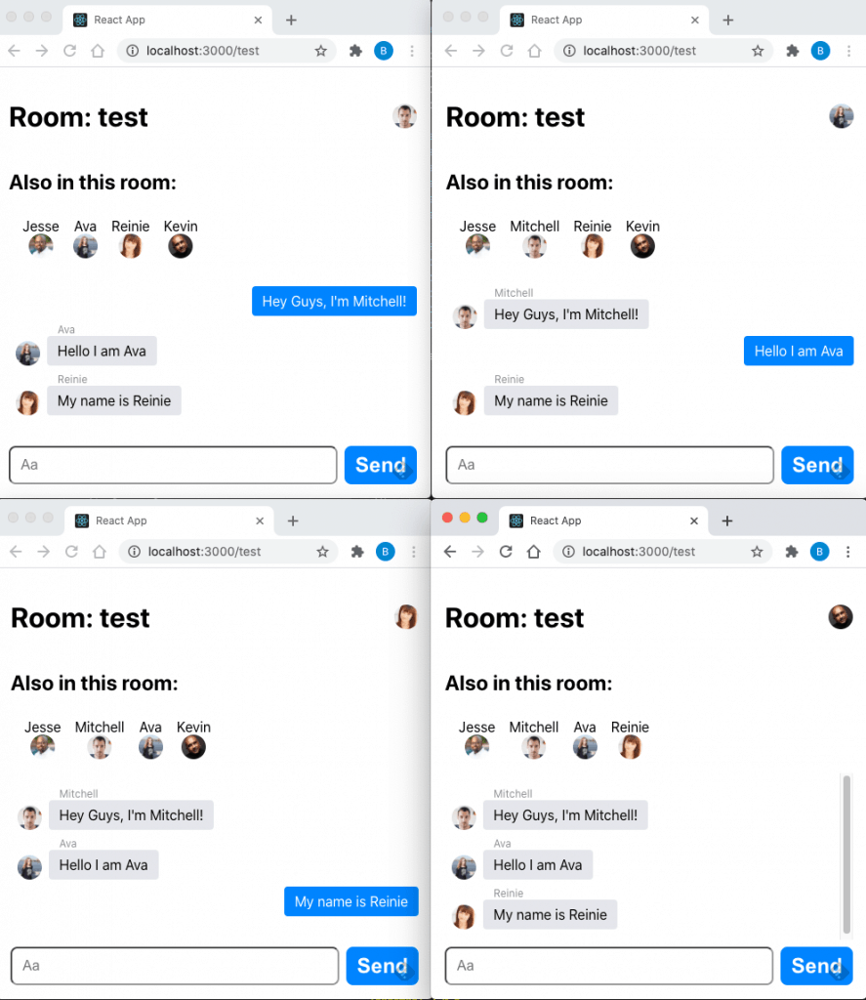

In this tutorial, we're going to build a simple chat application, similar to Messenger.

We'll use React for the frontend, Node.js for the backend. We'll handle the two-way communication client/server with sockets.

Get the code on [github](https://github.com/vitamindev/react-socket-chat)

## Architecture Overview


## Create the project

### Create the client project

Let's create a React project for client code:

```
npx create-react-app react-socket-chat
cd react-socket-chat
mkdir client
```

Copy all files generated by `create-react-app` within the `client` directory

### Create the server project

Next, let's create a Node.js project for server code:

```
mkdir server
cd server
npm init
npm install --save socket.io express
```

With the backend project created we can create a skeleton for the project:

```javascript
const http = require('http');
const express = require('express');
const cors = require('cors');
const socketIo = require('socket.io');

const app = express();
app.use(cors());

const PORT = 4000;

server.listen(PORT, () => {
  console.log(`Listening on port ${PORT}`);
});
```

If you run the project with

```
npm start
```

you should see:

```
Listening on port 4000
```

## Using socket to communicate from client to the server, and the server to the client

When a user sends a message to a chat room, we want all users connected to the chat room to be notified. We'll use sockets for that.

### Listening for messages on the backend

let's add socket.io to the server project

```
npm install --save socket.io
```

Next, let's add this code to index.js:

```javascript
const socketIo = require('socket.io');

const io = socketIo(server, {
  cors: {
    origin: 'http://localhost:3000',
    methods: ['GET', 'POST'],
    credentials: true,
  },
});

const NEW_CHAT_MESSAGE_EVENT = 'NEW_CHAT_MESSAGE_EVENT';

io.on('connection', (socket) => {
  console.log(`${socket.id} connected`);

  // Join a conversation
  const { roomId } = socket.handshake.query;
  socket.join(roomId);

  // Listen for new messages
  socket.on(NEW_CHAT_MESSAGE_EVENT, (data) => {
    io.in(roomId).emit(NEW_CHAT_MESSAGE_EVENT, data);
  });

  // Leave the room if the user closes the socket
  socket.on('disconnect', () => {
    socket.leave(roomId);
  });
});
```

Here is what happens in more details:

1. We import the socket.io module and create a new socket object. the cors parameter is necessary to execute the code locally (the frontend runs on http://localhost:3000). For more details, check how to [handle cors](https://socket.io/docs/v3/handling-cors/).
2. We define the NEW_CHAT_MESSAGE_EVENT constant. This is the event name the socket will listen to for new messages.
3. Upon a new connection, the socket will join the room requested.
4. When the socket receives a new message, it will simply emit it to the room, so all socket clients of the same room will receive it
5. When the socket is disconnected, it leaves the room.

### Listening and sending messages on the client

Just like we did on the server, we need to import socket.io on the client:

```
npm install --save socket.io
```

To keep the code clean, we'll create a useChat React hook, that will contain all the logic necessary to run a chat room:

```javascript
import { useEffect, useRef, useState } from 'react';
import socketIOClient from 'socket.io-client';

const NEW_CHAT_MESSAGE_EVENT = 'NEW_CHAT_MESSAGE_EVENT';
const SOCKET_SERVER_URL = 'http://localhost:4000';

const useChat = (roomId) => {
  const [messages, setMessages] = useState([]);
  const socketRef = useRef();

  useEffect(() => {
    socketRef.current = socketIOClient(SOCKET_SERVER_URL, {
      query: { roomId },
    });

    socketRef.current.on('connect', () => {
      console.log(socketRef.current.id);
    });

    socketRef.current.on(NEW_CHAT_MESSAGE_EVENT, (message) => {
      const incomingMessage = {
        ...message,
        ownedByCurrentUser: message.senderId === socketRef.current.id,
      };
      setMessages((messages) => [...messages, incomingMessage]);
    });

    return () => {
      socketRef.current.disconnect();
    };
  }, [roomId]);

  const sendMessage = (messageBody) => {
    if (!socketRef.current) return;
    socketRef.current.emit(NEW_CHAT_MESSAGE_EVENT, {
      body: messageBody,
      senderId: socketRef.current.id,
    });
  };

  return {
    messages,
    sendMessage,
  };
};

export default useChat;
```

There is a lot happening here!

## Adding user capability

While we can send and receive messages from different users in the chat, we don't know who sent the messages. It would be nice to see who is in the chat room, and who sent which message.

### Keeping track of the users in the server

Let's create a memory database to keep track of all users in different chat rooms. We'll write this code in users.js.

```javascript
const users = [];

const addUser = (id, room, name, picture) => {
  const existingUser = users.find(
    (user) => user.room === room && user.name === name
  );

  const user = { id, name, picture, room };
  users.push(user);
  return { id, name: user.name, picture: user.picture };
};

const removeUser = (id) => {
  const index = users.findIndex((user) => user.id === id);

  if (index !== -1) return users.splice(index, 1)[0];
};

const getUser = (id) => users.find((user) => user.id === id);

const getUsersInRoom = (room) => users.filter((user) => user.room === room);

module.exports = { addUser, removeUser, getUser, getUsersInRoom };
```

Next, when a user joins or leaves a room we'll notify other users in the room:

```javascript
const PORT = 4000;
const USER_JOIN_CHAT_EVENT = 'USER_JOIN_CHAT_EVENT';
const USER_LEAVE_CHAT_EVENT = 'USER_LEAVE_CHAT_EVENT';
const NEW_CHAT_MESSAGE_EVENT = 'NEW_CHAT_MESSAGE_EVENT';

io.on('connection', (socket) => {
  console.log(`${socket.id} connected`);

  // Join a conversation
  const { roomId, name, picture } = socket.handshake.query;
  socket.join(roomId);

  const user = addUser(socket.id, roomId, name, picture);
  io.in(roomId).emit(USER_JOIN_CHAT_EVENT, user);

  // Listen for new messages
  socket.on(NEW_CHAT_MESSAGE_EVENT, (data) => {
    io.in(roomId).emit(NEW_CHAT_MESSAGE_EVENT, data);
  });

  // Leave the room if the user closes the socket
  socket.on('disconnect', () => {
    removeUser(socket.id);
    io.in(roomId).emit(USER_LEAVE_CHAT_EVENT, user);
    socket.leave(roomId);
  });
});

server.listen(PORT, () => {
  console.log(`Listening on port ${PORT}`);
});
```

Let's add an endpoint to fetch all users in a room:

```javascript
app.get('/rooms/:roomId/users', (req, res) => {
  const users = getUsersInRoom(req.params.roomId);
  return res.json({ users });
});
```

### Creating a new user on the client

To keep things simple, we'll create a new random generated user every time there is a new connection to the chat room.

```javascript
import { useEffect, useRef, useState } from 'react';
import socketIOClient from 'socket.io-client';
import axios from 'axios';

const USER_JOIN_CHAT_EVENT = 'USER_JOIN_CHAT_EVENT';
const USER_LEAVE_CHAT_EVENT = 'USER_LEAVE_CHAT_EVENT';
const NEW_CHAT_MESSAGE_EVENT = 'NEW_CHAT_MESSAGE_EVENT';
const SOCKET_SERVER_URL = 'http://localhost:4000';

const useChat = (roomId) => {
  const [messages, setMessages] = useState([]);
  const [users, setUsers] = useState([]);
  const [typingUsers, setTypingUsers] = useState([]);
  const [user, setUser] = useState();
  const socketRef = useRef();

  useEffect(() => {
    const fetchUser = async () => {
      const response = await axios.get('https://api.randomuser.me/');
      const result = response.data.results[0];
      setUser({
        name: result.name.first,
        picture: result.picture.thumbnail,
      });
    };

    fetchUser();
  }, []);

  useEffect(() => {
    const fetchUsers = async () => {
      const response = await axios.get(
        `${SOCKET_SERVER_URL}/rooms/${roomId}/users`
      );
      const result = response.data.users;
      setUsers(result);
    };

    fetchUsers();
  }, [roomId]);

  useEffect(() => {
    if (!user) {
      return;
    }
    socketRef.current = socketIOClient(SOCKET_SERVER_URL, {
      query: { roomId, name: user.name, picture: user.picture },
    });

    socketRef.current.on('connect', () => {
      console.log(socketRef.current.id);
    });

    socketRef.current.on(USER_JOIN_CHAT_EVENT, (user) => {
      if (user.id === socketRef.current.id) return;
      setUsers((users) => [...users, user]);
    });

    socketRef.current.on(USER_LEAVE_CHAT_EVENT, (user) => {
      setUsers((users) => users.filter((u) => u.id !== user.id));
    });

    socketRef.current.on(NEW_CHAT_MESSAGE_EVENT, (message) => {
      const incomingMessage = {
        ...message,
        ownedByCurrentUser: message.senderId === socketRef.current.id,
      };
      setMessages((messages) => [...messages, incomingMessage]);
    });

    return () => {
      socketRef.current.disconnect();
    };
  }, [roomId, user]);

  const sendMessage = (messageBody) => {
    if (!socketRef.current) return;
    socketRef.current.emit(NEW_CHAT_MESSAGE_EVENT, {
      body: messageBody,
      senderId: socketRef.current.id,
      user: user,
    });
  };

  return {
    messages,
    user,
    users,
    sendMessage,
  };
};

export default useChat;
```

Here is what's new in the React hook:

1. When the hook mounts we create a new user
2. We keep track of all users in the chat room with a new useState hook.
   - When joining a room, we fetch the list of all users in the chat room
   - The socket listens for when a user joins or leave the chat room
3. When sending the message, we send the user that sent the message, not just the body text.

With this new code, we have a much better chat application already!



## Keep the messages history in the chat room

I'd be nice that when a user joins a room, he gets to see the whole message history.

### Keeping the messages in the backend.

Just like we did for users, we need to create a memory database for messages.

In order to assign a random id to messages, we'll use the uuid library.

```
npm install --save uuid
```

We can now create the messages memory database.

```javascript
var uuid = require('uuid');

const messages = [];

const addMessage = (room, message) => {
  const msg = { id: uuid.v4(), room, ...message };
  messages.push(msg);
  return msg;
};

const removeMessage = (id) => {
  const index = messages.findIndex((message) => message.id === id);

  if (index !== -1) return messages.splice(index, 1)[0];
};

const getMessage = (id) => messages.find((message) => message.id === id);

const getMessagesInRoom = (room) =>
  messages.filter((message) => message.room === room);

module.exports = { addMessage, removeMessage, getMessage, getMessagesInRoom };
```

We also need to create a new endpoint to fetch messages in index.js

```javascript
app.get('/rooms/:roomId/messages', (req, res) => {
  const messages = getMessagesInRoom(req.params.roomId);
  return res.json({ messages });
});
```

### Fetching the messages on the frontend

Let's add an effect to the useChat hook, so that we fetch the message history when joining a room.

```javascript
const useChat = (roomId) => {
  ...

  useEffect(() => {
    const fetchMessages = async () => {
      const response = await axios.get(
        `${SOCKET_SERVER_URL}/rooms/${roomId}/messages`
      );
      const result = response.data.messages;
      setMessages(result);
    };

    fetchMessages();
  }, [roomId]);

  ...

  return {
    messages,
    user,
    users,
    sendMessage,
  };
};

export default useChat;
```

Displaying when a user is typing

Most chat applications let you know when a user is typing a message, so let's do that.

### Listening for events on the server

We'll start by modifying index.js to listen for events when a user starts or stops typing. Just like for new messages, the socket will emit an event to notify all clients:

```javascript
...

const START_TYPING_MESSAGE_EVENT = "START_TYPING_MESSAGE_EVENT";
const STOP_TYPING_MESSAGE_EVENT = "STOP_TYPING_MESSAGE_EVENT";

io.on("connection", (socket) => {

  ...

  // Listen typing events
  socket.on(START_TYPING_MESSAGE_EVENT, (data) => {
    io.in(roomId).emit(START_TYPING_MESSAGE_EVENT, data);
  });
  socket.on(STOP_TYPING_MESSAGE_EVENT, (data) => {
    io.in(roomId).emit(STOP_TYPING_MESSAGE_EVENT, data);
  });

  ...

});

...
```

Handling when a user starts and stops typing on the client

When a user starts typing, we want to notify other users immediately. When the user stops typing we want to wait for 5 seconds before notifying, just in the case the user resumes typing.

We'll create a useTyping React hook to handle this logic:

```javascript
import { useEffect, useState } from 'react';

const useTyping = () => {
  const [isTyping, setIsTyping] = useState(false);
  const [isKeyPressed, setIsKeyPressed] = useState(false);
  const [countdown, setCountdown] = useState(5);

  const startTyping = () => {
    setIsKeyPressed(true);
    setCountdown(5);
    setIsTyping(true);
  };

  const stopTyping = () => {
    setIsKeyPressed(false);
  };

  const cancelTyping = () => {
    setCountdown(0);
  };

  useEffect(() => {
    let interval;
    if (!isKeyPressed) {
      interval = setInterval(() => {
        setCountdown((c) => c - 1);
      }, 1000);
    } else if (isKeyPressed || countdown === 0) {
      clearInterval(interval);
    }

    if (countdown === 0) {
      setIsTyping(false);
    }

    return () => clearInterval(interval);
  }, [isKeyPressed, countdown]);

  return { isTyping, startTyping, stopTyping, cancelTyping };
};

export default useTyping;
```

Next we need to use the useTyping hook in useChat:

```javascript
...

const START_TYPING_MESSAGE_EVENT = "START_TYPING_MESSAGE_EVENT";
const STOP_TYPING_MESSAGE_EVENT = "STOP_TYPING_MESSAGE_EVENT";
const SOCKET_SERVER_URL = "http://localhost:4000";

const useChat = (roomId) => {

  ...

  const [typingUsers, setTypingUsers] = useState([]);

  ...
  useEffect(() => {

    ...

    socketRef.current.on(START_TYPING_MESSAGE_EVENT, (typingInfo) => {
      if (typingInfo.senderId !== socketRef.current.id) {
        const user = typingInfo.user;
        setTypingUsers((users) => [...users, user]);
      }
    });

    socketRef.current.on(STOP_TYPING_MESSAGE_EVENT, (typingInfo) => {
      if (typingInfo.senderId !== socketRef.current.id) {
        const user = typingInfo.user;
        setTypingUsers((users) => users.filter((u) => u.name !== user.name));
      }
    });

    ...

  }, [roomId, user]);


  const startTypingMessage = () => {
    if (!socketRef.current) return;
    socketRef.current.emit(START_TYPING_MESSAGE_EVENT, {
      senderId: socketRef.current.id,
      user,
    });
  };

  const stopTypingMessage = () => {
    if (!socketRef.current) return;
    socketRef.current.emit(STOP_TYPING_MESSAGE_EVENT, {
      senderId: socketRef.current.id,
      user,
    });
  };

  return {
    messages,
    user,
    users,
    typingUsers,
    sendMessage,
    startTypingMessage,
    stopTypingMessage,
  };
};

export default useChat;
```

You can get the full code [here](https://github.com/vitamindev/react-socket-chat)
