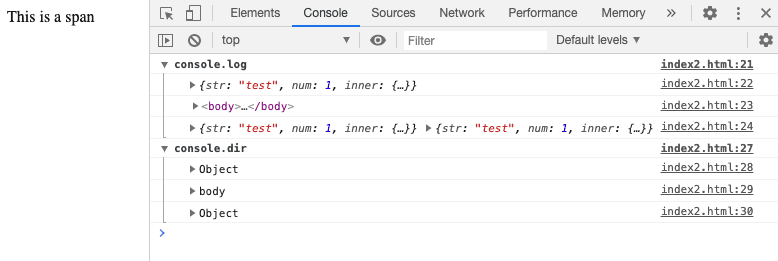
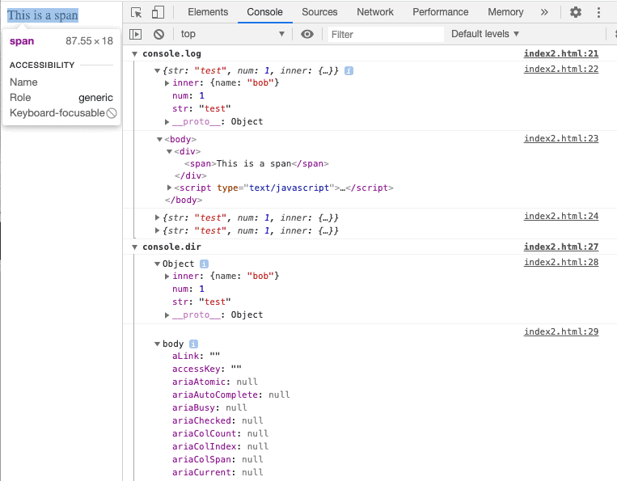

While `console.log` and `console.dir` can both output an object to the console, they serve a different purpose.

Here is a table that highlights the differences between `console.log` and `console.dir`:

| console.log                                              | console.dir                                            |
| -------------------------------------------------------- | ------------------------------------------------------ |
| Displays object in its string representation             | Displays a hierarchical, expandable view of the object |
| Shows HTML code of a DOM element                         | Shows all properties of a DOM element                  |
| Highlights DOM element and its children in DOM inspector | No integration with DOM inspector                      |
| Can display any number of objects                        | Can display only one object                            |

console.log vs console.dir

The code below demonstrates the results of `console.log` and `console.dir` on JavaScript objects and DOM elements.

```javascript
const node = document.body;
const obj = {
  str: 'test',
  num: 1,
  inner: {
    name: 'bob',
  },
};

console.group('console.log');
console.log(obj);
console.log(node);
console.log(obj, obj); // outputs both objects
console.groupEnd('console.log');

console.group('console.dir');
console.dir(obj);
console.dir(node);
console.dir(obj, obj); // outputs only first object
console.groupEnd('console.dir');
```



With properties expanded, notice how different `console.log` and `console.dir` display the DOM element.

- `console.log` displays the HTML code (and selecting the span elements interacts with the DOM inspector)
- `console.dir` displays the DOM node properties


