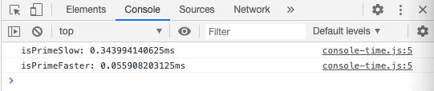

The simplest way to quickly compare the performance of 2 algorithms in JavaScript is to use the `console.time` and `console.timeEnd` methods.

Let's say you want to calculate if a number is a prime number or not. You write two functions that will return the result. One is more performant than the other but by how much?

```javascript
const isPrimeSlow = (n) => {
  if (n <= 1) {
    return false;
  }

  for (let i = 2; i < n; i++) {
    if (n % i == 0) {
      return false;
    }
  }
  return true;
};

const isPrimeFaster = (n) => {
  if (n <= 1) return false;
  if (n <= 3) return true;

  if (n % 2 == 0 || n % 3 == 0) return false;

  for (let i = 5; i * i <= n; i = i + 6)
    if (n % i == 0 || n % (i + 2) == 0) return false;

  return true;
};
```

To compare the performance of these implementations, you can create a function that'll accept any number of functions as arguments. This function will execute and time each function argument is it passed.

```javascript
const runPrimePerformance = (...arguments) => {
    for (var i=0; i < arguments.length; i++) {
        console.time(arguments[i].name);
        arguments[i](9973);
        console.timeEnd(arguments[i].name);
    }
}

runPrimePerformance(isPrimeSlow, isPrimeFaster);
```

- line 1: runPrimePerformance is a function that accepts any number of arguments
- line 2: loop through each argument
- line 3: start the timing, and use the function name as a label
- line 4: execute the function. We try to determine whether 9973 is a prime number.
- line 5: stop and print the timer to the console.
- line 9: run the performance function with the two algorithms

Running this code will output these logs to the console:


