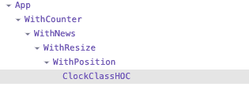

React hooks have been available since release 16.8.

The React blog has a great [introduction and motivation](https://reactjs.org/docs/hooks-intro.html#motivation) section about hooks. This post will explore why React hooks are great and how they can help you write better code.

## What are React hooks?

React hooks are functions. What's special about these functions is that they're designed to _hook_ into React functionalities such as state and lifecycle.

## What are the built-in hooks provided by React?

You can create your own custom hooks, composed from the built-in hooks provided by React. These hooks are:

- `useState`
- `useReducer`
- `useEffect`
- `useLayoutEffect`
- `useContext`
- `useRef`
- `useCallback`
- `useMemo`
- `useImperativeHandle`
- `useDebugValue`

To understand React hooks better, let's compare them with the traditional way of using state and side effects: class components.

## Class components

Before React hooks, if you wanted to manage state, use side effects (like calling an external API), you'd have to use a _class component_.

Let's take this component for example:

```javascript {numberLines}
import React, { Component } from 'react';
import Axios from 'axios';
import source$ from './source';

export class ClockClass extends Component {
  constructor(props) {
    super();
    this.state = {
      currentCount: props.initialCount,
      intervalId: null,
      loadingNews: true,
      news: [],
      subscription: null,
      position: null,
      smallWindowSize: false,
    };

    this.onResize = this.onResize.bind(this);
  }

  componentDidMount() {
    this.startCountdown(this.props.initialCount);
    this.fetchNews(this.props.query);
    const subscription = source$.subscribe((e) =>
      this.setState({ position: { x: e.offsetX, y: e.offsetY } })
    );
    this.setState({ subscription });

    window.addEventListener('resize', this.onResize);
  }

  componentDidUpdate(prevProps) {
    if (prevProps.initialCount !== this.props.initialCount) {
      this.startCountdown(this.props.initialCount);
    }
    if (prevProps.query !== this.props.query) {
      this.fetchNews(this.props.query);
    }
  }

  componentWillUnmount() {
    if (this.state.intervalId) {
      clearInterval(this.state.intervalId);
    }
    if (this.state.subscription) {
      this.state.subscription.unsubscribe();
    }
    window.removeEventListener('resize', this.onResize);
  }

  startCountdown(initialCount) {
    this.setState({ currentCount: initialCount });
    const intervalId = setInterval(async () => {
      if (this.state.currentCount > 0) {
        this.setState({ currentCount: this.state.currentCount - 1 });
      } else {
        clearInterval(this.state.intervalId);
        this.setState({ intervalId: null });
      }
    }, 1000);
    this.setState({ intervalId });
  }

  fetchNews(query) {
    this.setState({ loadingNews: true });
    Axios.get(`https://hn.algolia.com/api/v1/search?query=${query}`).then(
      (response) => {
        this.setState({ news: response.data.hits, loadingNews: false });
      }
    );
  }

  onResize() {
    if (window.innerWidth < 1000 && !this.state.smallWindowSize) {
      this.setState({ smallWindowSize: true });
    } else if (window.innerWidth >= 1000 && this.state.smallWindowSize) {
      this.setState({ smallWindowSize: false });
    }
  }

  render() {
    return (
      <div>
        <div>The counter is {this.state.currentCount}</div>
        <div>
          Small window size: {this.state.smallWindowSize ? 'yes' : 'no'}
        </div>
        <div>
          Position is X: {this.state.position?.x} Y: {this.state.position?.y}
        </div>
        <ul>
          {this.state.news.map((n, index) => (
            <li key={index}>
              <a href={n.url}>{n.title}</a>
            </li>
          ))}
        </ul>
      </div>
    );
  }
}

export default ClockClass;
```

This component has four pieces of logic:

1. Countdown (lines 9-10, 22, 33-35, 42-44, 51-62)
2. Fetching and displaying news (lines 11-12, 23, 36-38, 64-71)
3. Integrating with an observable (lines 13-14, 24-26, 45-47)
4. Responding to a window event (lines 15, 18, 29, 48, 73-79)

Notice how these pieces of logic are spread everywhere in the class? This is because React class component work is split into multiple lifecycle methods (`componentDidMount`, `componentDidUpdate`, `componentWillUnmount`). This problem is twofold:

1. A single lifecycle method (example: `componentDidMount`) contains multiple side effects
2. A single side effect (example: the countdown logic) is split into multiple lifecycle methods

What if you want to reuse each functionality for different components? A common workaround to this problem is to use _Higher-Order Component (HOC)_:

```javascript {numberLines}
import Axios from 'axios';
import React, { Component } from 'react';
import source$ from './source';

function withCounter(Component) {
  return class WithCounter extends Component {
    state = {
      currentCount: 0,
      intervalId: null,
    };

    componentDidMount() {
      this.startCountdown(this.props.initialCount);
    }

    componentDidUpdate(prevProps) {
      if (prevProps.initialCount !== this.props.initialCount) {
        this.startCountdown(this.props.initialCount);
      }
    }

    componentWillUnmount() {
      if (this.state.intervalId) {
        clearInterval(this.state.intervalId);
      }
    }

    startCountdown(initialCount) {
      this.setState({ currentCount: initialCount });
      const intervalId = setInterval(async () => {
        if (this.state.currentCount > 0) {
          this.setState({ currentCount: this.state.currentCount - 1 });
        } else {
          clearInterval(this.state.intervalId);
          this.setState({ intervalId: null });
        }
      }, 1000);
      this.setState({ intervalId });
    }

    render() {
      return <Component {...this.props} {...this.state}></Component>;
    }
  };
}

function withNews(Component) {
  return class WithNews extends Component {
    state = {
      news: [],
      loadingNews: false,
    };

    componentDidMount() {
      this.fetchNews(this.props.query);
    }

    componentDidUpdate(prevProps) {
      if (prevProps.query !== this.props.query) {
        this.fetchNews(this.props.query);
      }
    }

    fetchNews(query) {
      this.setState({ loadingNews: true });
      Axios.get(`https://hn.algolia.com/api/v1/search?query=${query}`).then(
        (response) => {
          this.setState({ news: response.data.hits, loadingNews: false });
        }
      );
    }

    render() {
      return <Component {...this.props} {...this.state}></Component>;
    }
  };
}

function withPosition(Component) {
  return class WithPosition extends Component {
    state = {
      subscription: null,
      position: null,
    };

    componentDidMount() {
      const subscription = source$.subscribe((e) =>
        this.setState({ position: { x: e.offsetX, y: e.offsetY } })
      );
      this.setState({ subscription });
    }

    componentWillUnmount() {
      if (this.state.subscription) {
        this.state.subscription.unsubscribe();
      }
    }

    render() {
      return <Component {...this.props} {...this.state}></Component>;
    }
  };
}

function withResize(Component) {
  return class WithResize extends Component {
    constructor() {
      super();
      this.state = {
        smallWindowSize: false,
      };
      this.onResize = this.onResize.bind(this);
    }

    componentDidMount() {
      window.addEventListener('resize', this.onResize);
    }

    componentWillUnmount() {
      window.removeEventListener('resize', this.onResize);
    }

    onResize() {
      if (window.innerWidth < 1000 && !this.state.smallWindowSize) {
        this.setState({ smallWindowSize: true });
      } else if (window.innerWidth >= 1000 && this.state.smallWindowSize) {
        this.setState({ smallWindowSize: false });
      }
    }

    render() {
      return <Component {...this.props} {...this.state}></Component>;
    }
  };
}

class ClockClassHOC extends Component {
  render() {
    return (
      <div>
        <div>The counter is {this.props.currentCount}</div>
        <div>
          Small window size: {this.props.smallWindowSize ? 'yes' : 'no'}
        </div>
        <div>
          Position is X: {this.props.position?.x} Y: {this.props.position?.y}
        </div>
        <ul>
          {this.props.news.map((n, index) => (
            <li key={index}>
              <a href={n.url}>{n.title}</a>
            </li>
          ))}
        </ul>
      </div>
    );
  }
}

export default withCounter(withNews(withResize(withPosition(ClockClassHOC))));
```

Each functionality is now split in its own HOC:

1. Countdown (lines 5-45)
2. Fetching and displaying news (lines 47-77)
3. Integrating with an observable (lines 79-103)
4. Responding to a window event (lines 105-135)

You can compose components with HOCs! This is much better!

Yet there is a major flaw with this approach. We're composing non-visual logic with visual components. This could quickly lead to wrapper hell with multiple levels of inheritance, increased complexity, and the potential for errors.



It doesn't have to be that way!

With this example in mind, let's see how React hooks can help us.

## Why React hooks?

Let's rewrite the component with React hooks:

```javascript
import Axios from 'axios';
import React, { useEffect, useState } from 'react';
import source$ from './source';

const ClockFunction = ({ initialCount, query }) => {
  const [currentCount, setCurrentCount] = useState(initialCount);
  const [news, setNews] = useState([]);
  const [position, setPosition] = useState();
  const [smallWindowSize, setSmallWindowSize] = useState(false);

  useEffect(() => {
    const intervalId = setInterval(() => {
      if (currentCount <= 0) {
        clearInterval(intervalId);
        return;
      }
      setCurrentCount((c) => c - 1);
    }, 1000);
    return () => clearInterval(intervalId);
  }, [currentCount]);

  useEffect(() => {
    Axios.get(`https://hn.algolia.com/api/v1/search?query=${query}`).then(
      (response) => {
        setNews(response.data.hits);
      }
    );
  }, [query]);

  useEffect(() => {
    const subscription = source$.subscribe((e) =>
      setPosition({ x: e.offsetX, y: e.offsetY })
    );
    return () => subscription.unsubscribe();
  }, []);

  useEffect(() => {
    function onResize() {
      if (window.innerWidth < 1000 && !smallWindowSize) {
        setSmallWindowSize(true);
      } else if (window.innerWidth >= 1000 && smallWindowSize) {
        setSmallWindowSize(false);
      }
    }

    window.addEventListener('resize', onResize);
    return () => window.removeEventListener('resize', onResize);
  }, [smallWindowSize]);

  return (
    <div>
      <div>The counter is {currentCount}</div>
      <div>Small window size: {smallWindowSize ? 'yes' : 'no'}</div>
      <div>
        Position is X: {position?.x} Y: {position?.y}
      </div>
      <ul>
        {news.map((n, index) => (
          <li key={index}>
            <a href={n.url}>{n.title}</a>
          </li>
        ))}
      </ul>
    </div>
  );
};

export default ClockFunction;
```

### No longer need to use class components

Classes in JavaScript are not bad, but as a developer, you'd need to apply two mental models: one for functional components, and another one for class components. For example, when using class components, you need to understand how the `this` keyword is used, remember to properly create a constructor, and bind event handlers. So much boilerplate code.

React hooks allow you to do everything class components do, with functional components.

### Encapsulation of side-effects

React hooks allow for side effects logic to reside in a single function.

No more need to spread logic across `componentDidMount`/`componentDidUpdate`, each side effect logic is contained within a `useEffect` function.

The cleanup code is returned by the side effect function, so there is no need for `componentWillUnmount` either.

### Composition with reusable logic

With custom React hook, you can compose your own hooks and provide reusable logic. This is a big improvement over the HOC pattern, since it will not clutter the component hierarchical tree.

```javascript
const useCountdown = (initialCount) => {
  const [currentCount, setCurrentCount] = useState(initialCount);

  useEffect(() => {
    if (currentCount <= 0) {
      return;
    }
    const intervalId = setInterval(
      () => setCurrentCount(currentCount - 1),
      1000
    );
    return () => clearInterval(intervalId);
  }, [currentCount]);

  return { currentCount };
};
```

```javascript
const useNews = (query) => {
  const [news, setNews] = useState([]);
  useEffect(() => {
    Axios.get(`https://hn.algolia.com/api/v1/search?query=${query}`).then(
      (response) => {
        setNews(response.data.hits);
      }
    );
  }, [query]);

  return { news };
};
```

```javascript
const useMousePosition = () => {
  const [position, setPosition] = useState();
  useEffect(() => {
    const subscription = source$.subscribe((e) =>
      setPosition({ x: e.offsetX, y: e.offsetY })
    );
    return () => subscription.unsubscribe();
  }, []);

  return { position };
};
```

```javascript
const useSmallWindowSize = () => {
  const [smallWindowSize, setSmallWindowSize] = useState(false);
  useEffect(() => {
    function onResize() {
      if (window.innerWidth < 1000 && !smallWindowSize) {
        setSmallWindowSize(true);
      } else if (window.innerWidth >= 1000 && smallWindowSize) {
        setSmallWindowSize(false);
      }
    }

    window.addEventListener('resize', onResize);
    return () => window.removeEventListener('resize', onResize);
  }, [smallWindowSize]);

  return { smallWindowSize };
};
```

Here is how a component would use these hooks:

```javascript
const ClockCustomHooks = ({ initialCount, query }) => {
  const { currentCount } = useCountdown(initialCount);
  const { news } = useNews(query);
  const { position } = useMousePosition();
  const { smallWindowSize } = useSmallWindowSize();

  return (
    <div>
      <div>The counter is {currentCount}</div>
      <div>Small window size: {smallWindowSize ? 'yes' : 'no'}</div>
      <div>
        Position is X: {position?.x} Y: {position?.y}
      </div>
      <ul>
        {news.map((n, index) => (
          <li key={index}>
            <a href={n.url}>{n.title}</a>
          </li>
        ))}
      </ul>
    </div>
  );
};

export default ClockCustomHooks;
```

React Hooks are a great addition to the React library. In future articles, we'll explore how to use specific hooks to our advantage.
