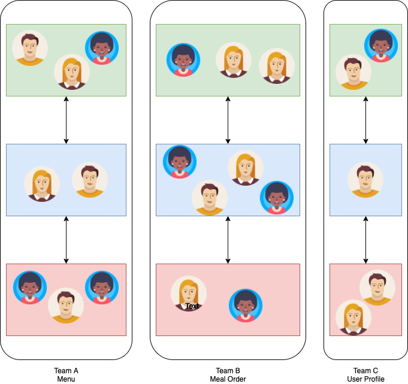
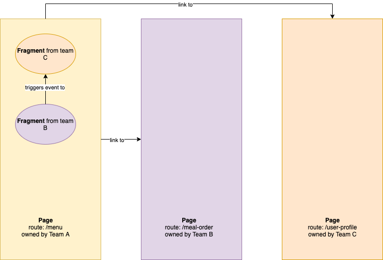

This is the first article of a series that will explore what are micro frontends and how to use them. We’ll start by exploring what are micro frontends and why we need them.

TL;DR

- Micro frontends is an architectural pattern. It divides the application in **vertical slices** , instead of horizontal layers
- Each vertical slice is a **cross-functional team**. A team is dedicated to a mission. The team develop the feature from end-to-end (frontend, backend, database).
- The **team is independent**, focuses on functionality, and owns its tech stack
- The main benefit of micro frontends is the **improved productivity**
- The smallest delivery in a micro frontend is a **fragment**. A fragment is a mini-application, self-contained with all its dependencies. Pages can embed fragments.

## Why do we need micro frontends?

Development teams are usually organized by technical specialty. DBAs take care of databases. Backend developers take care of business logic. Frontend developer take care of user interfaces and interactions.

In a large organization, you can end up with teams of dozens of developers in each layer, for a single product.

What could go wrong? Many things, actually.

1. Updating a library for a feature can cause side effects in another feature. Even more so if the library has breaking changes.
2. Deployment on the frontend is dependent on all features. It’s an all-or-nothing deployment. Let’s say a deployment is scheduled for Wednesday evening. Developers will rush to push their change before the release. If there is a problem, the whole deployment is rolled back.
3. All members of the frontend team must be familiar with the same technology/web framework. Some teams might be more familiar with Angular, whereas others might prefer React.

Look at the diagram above. Why do backend developers can enjoy a micro-service architecture, while frontend cannot?

Turns out we can with micro frontends.

## What are micro frontends?

## Vertical slices

A micro frontend architecture divides an application into vertical slices. This is in contrast to horizontal layers.

Let’s take an example. We want build a large fast food online web application.

In a monolithic user interface, we would require an army of frontend developers to build the system. All the developers would need to agree on a tech stack. Be dependent on each other when a new feature needs to be developped.

What if we could divide the application in teams per /feature/.

- Team A handles the menu
- Team B handles the meal order
- Team C handles the user profile

Even better if the teams adhere to the [Two-Pizza rule](https://docs.aws.amazon.com/whitepapers/latest/introduction-devops-aws/two-pizza-teams.html)

### Integration

Since a team handles a certain feature, it’ll develop the pages necessary for it. How the team develops the pages is not important. Each team can use a different tech stack. What’s important is that they can integrate in the application. This is usually done with **routing**.

An interesting aspect is that a page might use **composition**. For example, a page from team A might need a widget from team B and another one from team C. Team B and C can provide **fragments**. Each team handles the implementation of their respective fragment.

Micro frontends can involve **communication** between fragments and pages. Consider a user clicking on a button in the fragment from team B. This event might trigger a response in the fragment from team C. Or the page from team A.

Micro frontends integration is a large topic. We’ll explore integration further in future articles.

## What are the benefits of micro frontends?

The benefits of micro frontends are:

1. **Improved productivity**: the structure of the teams is optimized for feature development. Each team focuses on a feature. The team constrains discussions about the feature to its members. Less discussion overhead!
2. **Iterative development**: each team is autonomous. It can deploy new functionalities or bug fixes when need be.
3. **Easier to refactor**: modifications to a smaller code base can be performed efficiently. Especially compared to a monolithic application.

## When not to use micro frontends?

Of course, micro frontends are not the solution to every problem.  
A micro frontend architecture might not be worth it if the application:

- Is small
- Cannot be clearly divided in vertical slices

Unlike backend micro-services, we can’t add more RAM or bandwidth to a micro frontend.
Yep, it’s not that easy to scale a frontend!

Performance is a tricky subject in micro frontends.
Monitoring the web performance as early as possible in a project.
That can be a major turn-off for many teams as well.

## Conclusion

Micro frontends is a promising architecture. In this article we’ve learned why it is such a hot topic.
