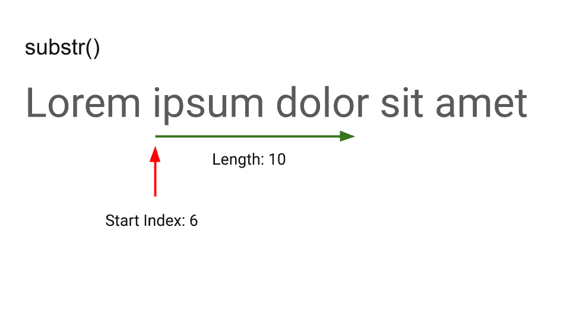
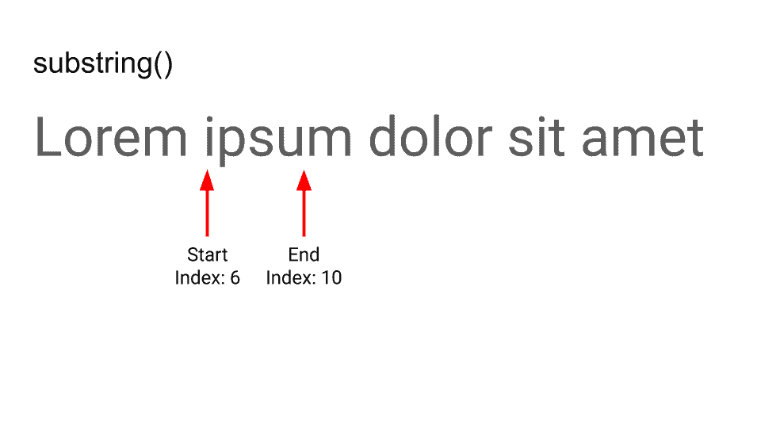

There are two JavaScript functions to extract a parts of a string: `[substr()](https://developer.mozilla.org/en-US/docs/Web/JavaScript/Reference/Global_Objects/String/substr)` and `[substring()](https://developer.mozilla.org/en-US/docs/Web/JavaScript/Reference/Global_Objects/String/substring)`.

Both functions extracts a substring starting from an index.

The difference between `substr()` and `substring()` is that **substr() extracts the substring based on its length, whereas substring() extracts the substring based on its start and end indexes**.

Example:

```javascript
const test = 'Lorem ipsum dolor sit amet';
console.log('substr:', test.substr(6, 10));
console.log('substring:', test.substring(6, 10));
```

Outputs:

```
substr:ipsum dolo
substring:ipsu
```

The following images highlights the differences between the two functions:





Note that since `substr()` is a [deprecated feature](https://developer.mozilla.org/en-US/docs/Web/JavaScript/Reference/Deprecated_and_obsolete_features), you should avoid using it and favour `substring()` instead.
