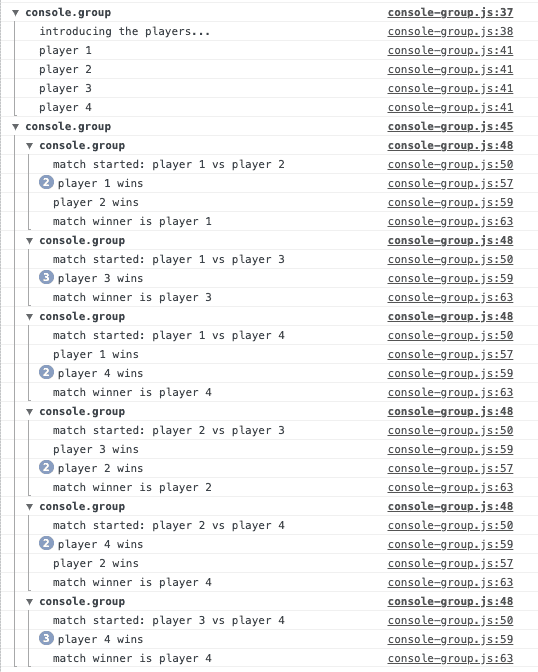

Logging to the console is a simple yet powerful technique In JavasScript that can save you a lot of time and effort.

While it is recommended that you don't log to the console in production, it can be a life saver during development.

To get an overview of how to use the console in Chrome, check this [tutorial](https://developers.google.com/web/tools/chrome-devtools/console/log). This rest of this article will go deeper.

## How to view the console log

### Open Google Chrome

For the remaining the article, we'll use Google Chrome on a mac. To get things started, open the Google Chrome application.  
Start Spotlight ( **⌘**Spacebar), then type Google Chrome.

### Open the Developer Tools panel

From the Google Chrome menu (the three dots in the upper right corner), select More Tools, then Developer Tools.  
You can also use the short key F12 or ⌥**⌘**i

### Select the Console tab

From the new Developer Tools panel, select the Console tab. You can start to use the Google Chrome console.

## How to log a value

### Logging a value

To log a value, use the `console.log` method.

```javascript
const x = 1;
console.log(x);
```


### Logging a value with a message

You can add a message before the value

```javascript
console.log('x value is:', x);
```


## How to format logs

### Logging values with string substitution

Instead of using the dreaded string concatenation to print multiple values, you can log messages to the console using string substitution:

```javascript
const name = 'Alice';
const age = 32;

// don't use this
console.log('Hey! my name is ' + name + ' and I am ' + age + ' years old');

// use this instead
console.log('Hey! my name is %s and I am %d years old', name, age);
```


Here is a list of all string substitutions supported by the console object

| Substitution String | Description                                   |
| ------------------- | --------------------------------------------- |
| %s                  | Formats value as a string                     |
| %d or %i            | Formats value as an integer                   |
| %f                  | Formats value as a floating-point value       |
| %o                  | Formats value as expandable DOM element       |
| %O                  | Formats value as expandable JavaScript object |
| %c                  | Formats value as CSS style                    |

```javascript
console.log('logging an object');
const test = { a: 'a', b: 'b' };
console.log('string: %s', test);
console.log('number: %d', test);
console.log('float: %f', test);
console.log('o: %o', test);
console.log('O: %O', test);

console.log('logging a number');
console.log('string: %s', 1.5);
console.log('number: %d', 1.5);
console.log('float: %f', 1.5);
console.log('o: %o', 1.5);
console.log('O: %O', 1.5);
```


### Styling console log with CSS

As mentioned in the table above, you can apply CSS styles to the console log with the `%c` substitution.

Here are a few examples.

```javascript
console.log('%cthis text is blue', 'color:blue');
console.log('%cthis text is bold', 'font-weight:bold');
console.log('%cthis text has padding', 'padding:20px');
```


You can combine multiple CSS rules to create interesting effects.

```javascript
console.log(
  '%cPASSED',
  'background-color:green; color:white; padding:8px;border-radius:8px;',
  'the test has passed'
);
console.log(
  '%cFAILED',
  'background-color:red; color:white; padding:8px;border-radius:8px;',
  'the test has failed'
);
```


## How to log an object

### Logging a single object

To log an object, you can also use the `console.log` method.

```javascript
const foo = { a: 1, b: 2 };
console.log(foo);
```


The console will display the object properties in a single line by default. You can click on the arrow to expand the object properties.


This is particularly handy if you have a complex object with nested properties:

```javascript
const complex = {
  a: 1,
  b: 2,
  c: {
    d: 4,
    e: 5,
    f: {
      g: 7,
      h: 8,
    },
  },
};
console.log(complex);
```


Another way to log an object is to use `console.dir`. While they are somewhat similar, [`console.log` and `console.dir` log DOM nodes differently](https://vitamindev.com/javascript/console-log-vs-console-dir/).

### Showing the name of the object in the console

While `console.log` displays the object properties, it does not show the object name itself. This can be annoying if you want to log different objects with the same properties.

```javascript
const object1 = { a: 1, b: 2 };
const object2 = { a: 3, b: 4 };
const object3 = { a: 5, b: 6 };
console.log(object1);
console.log(object2);
console.log(object3);
```


Which object is which?

In the example above, it's hard to know which log corresponds to which object.

**To display the object name in the console log, wrap the object in curly braces {}.**

```javascript
console.log({ object1 });
console.log({ object2 });
console.log({ object3 });
```


You can also use the shorter syntax:

```javascript
console.log({ object1, object2, object3 });
```

### Logging multiple objects

You can log multiple objects on the same console line

```javascript
const bob = { name: 'Bob', age: 41 };
const ann = { name: 'Ann', age: 32 };
console.log('p:', bob, 'p:', ann);
```


### A word of caution regarding logging an object with changing values

Many browsers will provide a live view of the object in the console. This can be a problem if the object is updated after it has been outputted to the console.

Consider this example:

```javascript
const updatingObject = { a: 1 };
console.log(updatingObject);
setInterval(() => updatingObject.a++, 1000);
```


The collapsed and expanded object properties don't have the same value

Here is what is happening step by step:

- Line 1: We create an object with a property with value of 1
- Line 2: The object is outputted to the console. Note that the object properties are collapsed.
- Line 3: We increment the object property every second.

By the time we expand the object properties in the console, a few seconds have elapsed and the and the object has been updated.

So to fix this problem?

**In order to console log an object with updating properties, convert the object to a string, then convert it back to an object, with the JSON functions.**

```javascript
const updatingObject = { a: 1 };
console.log(JSON.parse(JSON.stringify(updatingObject)));
setInterval(() => updatingObject.a++, 1000);
```


## How to log information, warnings, and errors

To log information, use the `console.info` method.

```javascript
console.info('this is an information');
```

To log a warning use the `console.warn` method.

```javascript
console.warn('this is a warning');
```

To log an error use `console.error` method.

```javascript
console.error('this is an error');
```


## How to log an exception

Just like logging an error, **to log an exception use the `console.error` function**.

```javascript
try {
  throw new Error('this is an exception');
} catch (err) {
  console.error(err);
}
```


## How to log a stack trace

**To log a stack trace within a function, use the `console.trace()` method.**

```javascript
const bar = () => {
  console.trace('trace bar()');
};

const foo = () => {
  bar();
};

foo();
```

In the example above, the call to `console.trace` (line 2) will log the whole call stack at this point.


You can click on any function call of the call stack to view the corresponding line of code. For example, clicking on console-trace.js:6 will display this code:


## How to log depending on a condition

You can add a log to the console depending on a condition using an assertion. **In order to log an assertion, use the `console.assert` method.**

```javascript
const bar = () => {
  console.assert(false, 'assert is called');
  console.log('this code is still executed');
};

const foo = () => {
  console.assert(true, 'assert is not called');
  bar();
};

foo();
```

The method `console.assert()` will add the log to the console if the assertion is not true (ie: the condition is not met, as in line 2). Note that if the assertion is not met, the code execution is not stopped.


Just like `console.trace`, `console.assert` will also output the call stack so you can inspect the code.

## How to log an array

If you have a simple array, you can log it with the `console.log` method.

```javascript
const names = ['Bob', 'John', 'Jack'];
console.log(names);
```

However, you can display a complex array more clearly with a table format. **To log an array with the table format, use the `console.table` method.**

```javascript
const persons = [
  { name: 'Bob', age: 31, gender: 'M', salary: 30000 },
  { name: 'John', age: 77, gender: 'M', salary: 47000 },
  { name: 'Nancy', age: 12, gender: 'F' },
  { name: 'Jack', age: 26, gender: 'M', salary: 25000 },
  { name: 'Alice', age: 75, gender: 'F', salary: 100000 },
];
console.table(persons);
```


The example above demonstrates that we can display all properties of objects in an array. How can we log specific properties of objects in an array? **To log some properties of objects in an array, pass the property names to the `console.table` method.**

```javascript
console.table(persons, ['age', 'gender']);
```


## How to group related logs

If you have a large number of logs, it can be difficult to go through all of them.

Consider this example of a tournament of 4 players, competing one against the other:

```javascript
const pairsOfArray = (array) =>
  array.reduce(
    (acc, val, i1) => [
      ...acc,
      ...new Array(array.length - 1 - i1)
        .fill(0)
        .map((v, i2) => [array[i1], array[i1 + 1 + i2]]),
    ],
    []
  );

console.log('introducing the players...');
const players = ['player 1', 'player 2', 'player 3', 'player 4'];
players.forEach((player) => {
  console.log(player);
});

const matches = pairsOfArray(players);
matches.forEach((pair) => {
  const match = `${pair[0]} vs ${pair[1]}`;
  console.log('match started:', match);
  let wins1 = 0;
  let wins2 = 0;
  const rounds = [1, 2, 3];
  rounds.forEach((round) => {
    if (Math.random() > 0.5) {
      wins1++;
      console.log(`${pair[0]} wins`);
    } else {
      console.log(`${pair[1]} wins`);
      wins2++;
    }
  });
  console.log(`match winner is ${wins1 > wins2 ? pair[0] : pair[1]}`);
});
```

There is a lot going on here.

- Lines 1 to 7: a helper function to create pairs out of an array
- Lines 9 to 13: introduces players of the tournament
- Line 15: creates a list of all matches in the tournament
- Lines 16 to 21: starts each match
- Lines 22 to 30: executes 3 rounds for each match
- Line 31: logs the winner of each match

The console log for this simple program is a bit of a mess:


You can make your logs more readable by grouping related logs. **To group logs together, wrap the logs between `console.group` and `console.groupEnd` statements.**

```javascript
console.group();
console.log('introducing the players...');
const players = ['player 1', 'player 2', 'player 3', 'player 4'];
players.forEach((player) => {
  console.log(player);
});
console.groupEnd();

console.group();
const matches = pairsOfArray(players);
matches.forEach((pair) => {
  console.group();
  const match = `${pair[0]} vs ${pair[1]}`;
  console.log('match started:', match);
  let wins1 = 0;
  let wins2 = 0;
  const rounds = [1, 2, 3];
  rounds.forEach((round) => {
    if (Math.random() > 0.5) {
      wins1++;
      console.log(`${pair[0]} wins`);
    } else {
      console.log(`${pair[1]} wins`);
      wins2++;
    }
  });
  console.log(`match winner is ${wins1 > wins2 ? pair[0] : pair[1]}`);
  console.groupEnd();
});
console.groupEnd();
```

We've improved the readability of the log by grouping the players' introduction (lines 1 and 7) and the matches (lines 9 and 30).

Lines 12 and 28 demonstrates another property groups: they can be nested. Each match is grouped within the larger matches group.



Noticed how each group is named `console.group`? While this is helpful to group logs together, it does not tell much about what the group is about.

**To name a console log group, use the `label` property of `console.group` and c`onsole.groupEnd` functions.**

```javascript
console.clear();
console.group('introducing the players');
const players = ['player 1', 'player 2', 'player 3', 'player 4'];
players.forEach((player) => {
  console.log(player);
});
console.groupEnd('introducing the players');

console.group('matches');
const matches = pairsOfArray(players);
matches.forEach((pair) => {
  const match = `${pair[0]} vs ${pair[1]}`;
  console.group(`match started: ${match}`);
  let wins1 = 0;
  let wins2 = 0;
  const rounds = [1, 2, 3];
  rounds.forEach((round) => {
    if (Math.random() > 0.5) {
      wins1++;
      console.log(`${pair[0]} wins`);
    } else {
      console.log(`${pair[1]} wins`);
      wins2++;
    }
  });
  console.log(`match winner is ${wins1 > wins2 ? pair[0] : pair[1]}`);
  console.groupEnd(`match started: ${match}`);
});
console.groupEnd('matches');
```

The code above outputs the following logs:


This is much better already! There is one last improvement we can do to this code. We might not care about the detail of each round of each match, but still want to keep it in the logs.

**To hide a console log group by default, use `console.groupCollapsed` instead of `console.group`.** You can always expand this group later on.

```javascript
console.group('introducing the players');
const players = ['player 1', 'player 2', 'player 3', 'player 4'];
players.forEach((player) => {
  console.log(player);
});
console.groupEnd('introducing the players');

console.group('matches');
const matches = pairsOfArray(players);
matches.forEach((pair) => {
  const match = `${pair[0]} vs ${pair[1]}`;
  console.groupCollapsed(`match started: ${match}`);
  let wins1 = 0;
  let wins2 = 0;
  const rounds = [1, 2, 3];
  rounds.forEach((round) => {
    if (Math.random() > 0.5) {
      wins1++;
      console.log(`${pair[0]} wins`);
    } else {
      console.log(`${pair[1]} wins`);
      wins2++;
    }
  });
  console.groupEnd(`match started: ${match}`);
  console.log(`match winner is ${wins1 > wins2 ? pair[0] : pair[1]}`);
});
console.groupEnd('matches');
```

In the code above, the console log group defined at line 12 is collapsed by default.


## How to log count

To count the number of times a piece of code has been called, use the `console.count` method.

```javascript
for (let i = 0; i < 3; i++) {
  // do something...
  console.count();
}
```


### Resetting the counter

You might need to log multiple counts in your application. Use the `console.countReset` method to reset the counter.

```javascript
for (let i = 0; i < 3; i++) {
  // do something...
  console.count();
}

console.countReset();

for (let i = 0; i < 5; i++) {
  // do something...
  console.count();
}
```


### Labeling counters

If you want to use multiple counters, you can make the logs more readable by using the `label` argument.

```
for (let i=0; i<3; i++) {
    console.count('outer loop')
    for (let j=0; j<2; j++) {
        // do something...
        console.count('inner loop');
    }
    console.countReset('inner loop');
}
```


## How to measure and log performance

**If you want to quickly measure and log the performance of an algorithm in Javascript, use the console.time and console.TimeEnd methods**. In a nutshell `console.time` will calculate and display the time elapsed for a piece of code.

Note that this method is only useful to measure the performance for bits code. If you want to measure the performance of the whole application, you'd better use the dedicated [browser dev tools](https://developers.google.com/web/tools/chrome-devtools/evaluate-performance/).

For example, the following code will log how long it takes to fill in an array of 10,000 numbers:

```javascript
console.time();
const numbers = [];
for (let i = 0; i < 10000; i++) {
  numbers.push(i);
}
console.timeEnd();
```


### Labeling time

You can use a specific label for clarity. This is useful if you want to log multiple performances:

```javascript
console.time('fill array');
const numbers = [];
for (let i = 0; i < 10000; i++) {
  numbers.push(i);
}
console.timeEnd('fill array');

console.time('copy array');
const copy = [];
copy.push(...numbers);
console.timeEnd('copy array');
```


You can also use `console.time` and `console.timeEnd` to [compare the performance of different algorithms](https://vitamindev.com/javascript/how-to-compare-the-performance-of-different-functions/).

## How to clear the console log

To cleat the console log, use the `console.clear` method.

## How to copy an object from the console log

Once you've logged an object to the console, it can be useful to copy this object to the clipboard for later use.

Here is how to copy an object from the console to the clipboard:

1. Right-click on the object in the console
2. Select the "Store as global variable" menu item
3. By default, the new variable will be named `temp1`
4. Type `copy(temp1)` to the console to store the object to the clipboard
5. The object has been stored in JSON format to the clipboard

## How to filter console logs based on the severity level

Each console method has a severity level. **You can filter console logs in Google Chrome from the Levels dropdown, in the Console tab.**


You can select a combination of severity levels to display different logs.

The default level filter in Chrome is to hide debug logs. This is a common reason why developers can't find these logs.

Here is a table of all severity level for each console method:

| Method          | Severity Level |
| --------------- | -------------- |
| console.assert  | Error          |
| console.count   | Info           |
| console.debug   | Verbose        |
| console.dir     | Info           |
| console.dirxml  | Info           |
| console.error   | Error          |
| console.info    | Info           |
| console.log     | Info           |
| console.table   | Info           |
| console.timeEnd | Info           |
| console.trace   | info           |
| console.warn    | Warning        |
|                 |                |
